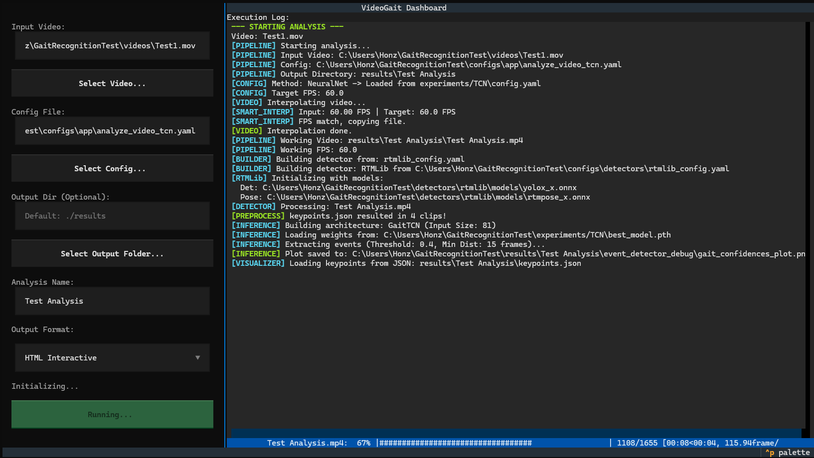

# VideoGait

**VideoGait** is an experimental application for automated human gait analysis from monocular 2D RGB video. 
This project was developed as part of a Master's Thesis *(a link to the thesis text will be added in the future, although it will be available only in Czech)*.

The application features a complete pipeline that takes a raw video of a walking person, extracts their skeletal pose, detects key gait events (Heel Strikes and Toe Offs), and generates detailed PDF or interactive HTML reports containing gait parameters (step length, angles, velocities, symmetry, and more).

## 📸 Showcase


*Interactive Textual-based terminal UI for configuring and running the analysis.*


*Example of a generated PDF report containing spatiotemporal and kinematic gait parameters.*


*Example of a generated interactive HTML report with dynamic charts and synchronized video playback.*

---

## ⚠️ Medical & Liability Disclaimer
**This software is an experimental prototype.** It is **NOT** a medical device, and it is **NOT** intended for medical diagnosis, clinical gait analysis, treatment, or any healthcare-related decisions. The results generated by this pipeline are not 100% accurate and have not been medically verified.

---

## ✨ Features

1. **Pose Extraction:** Utilizes existing state-of-the-art keypoint detectors to extract human poses from video.
2. **Gait Event Detection:** 
   * **Heuristic Methods:** Based on established biomechanical algorithms.
   * **Neural Networks:** Includes implementations of BiLSTM, BiGRU, TCN, Transformer, and ST-GCN trained specifically for gait event detection.
3. **Report Generation:** Automatically generates comprehensive gait reports analyzing kinematics, spatiotemporal metrics, and gait symmetry in PDF or interactive HTML formats.

---

## 📊 Dataset & Pre-trained Models
- **Dataset:** The neural networks and heuristic benchmarks were developed and evaluated using the publicly available **KOA-PD-NM** dataset. Please note that the dataset itself is **not distributed** within this repository. You can get it from the original authors ([Mendeley Data](https://data.mendeley.com/datasets/44pfnysy89/1)).
- **Model Weights:** Due to the medical and sensitive nature of the dataset (even though it is publicly available for research), the trained weights for the neural networks are **not included** in this repository to ensure strict privacy and compliance. You will need to acquire the dataset and train the models from scratch.

---


## 🛠️ Installation & Setup

### 1. Prerequisites
- Developed and tested using **Python 3.11**.

### 2. Base Requirements
Install the core Python dependencies using `pip`:
```bash
pip install -r requirements.txt
```

### 3. PDF Export Setup (WeasyPrint)
To generate beautiful PDF reports, the `weasyprint` Python library requires some additional system-level dependencies (like GTK) to be installed on your OS.
Please follow the official guide to set it up for your specific system:

👉 [WeasyPrint Installation Guide](https://doc.courtbouillon.org/weasyprint/stable/first_steps.html#installation)

### 4. Hardware Acceleration (CUDA) 
If you want to run the neural networks and pose extractors on your GPU, you will need to set up CUDA. 
*Note: Getting PyTorch and ONNX Runtime to play nicely with your specific CUDA and cuDNN versions can be a bumpy ride. We send our hopes and prayers. Good luck!*

### 5. Detector Setup
The project relies on external models for video interpolation and pose extraction. You **must** download the weights and set them up manually. Please refer to the specific setup guides:

- [RTMLib Setup](detectors/rtmlib/setup.md)
- [Google MediaPipe Setup](detectors/google_mediapipe/setup.md)
- [AlphaPose Setup](detectors/alphapose/setup.md)
- [RIFE Setup](rife/setup.md)

*(Note on **AlphaPose**: AlphaPose is supported but is not directly included in this repository due to its strict licensing. If you wish to use it, you must acquire and set it up yourself following their official guidelines.)*

### 6. Dataset setup
Obtain a copy of the KOA-PD-NM dataset, and extract it into the `dataset/` folder so the internal file structure looks exactly like this:

```text
dataset/
├── KOA/
│   ├── KOA_EL/   *.MOV
│   ├── KOA_MD/   *.MOV
│   └── KOA_PD/   *.MOV
├── NM/           *.MOV
└── PD/
    ├── PD_MD/    *.MOV
    ├── PD_ML/    *.MOV
    └── PD_SV/    *.MOV
```

After that run the dataset preparation tool:
```bash
python tools/prepare_dataset.py
```

---

## 🚀 How to Use

The project is highly modular. Here are the main entry points depending on what you want to do:

### Graphical User Interface (TUI)
The easiest way to run the analysis pipeline is through the interactive Textual-based dashboard:
```bash
python run_gui.py
```

### Main Analysis Pipeline (CLI)
If you prefer the command line, you can run the full end-to-end pipeline (interpolation -> extraction -> detection -> report) directly:
```bash
python main.py --video path/to/video.mp4 --config configs/app/default.yaml --format pdf
```

### Training Neural Networks
Train a specific model using its configuration file:
```bash
python gaitDetectNN/tools/train.py --config configs/train/bigru.yaml
```

### Hyperparameter Tuning
Run Bayesian optimization (Optuna) to find the best hyperparameters for a model:
```bash
python gaitDetectNN/tools/tune.py --config configs/train/bigru.yaml --trials 50
```

### Benchmarking
Evaluate and compare the performance of Neural Networks or Heuristics against ground truth data:
```bash
python benchmark/run_benchmark.py --config configs/benchmark/benchmark_default.yaml
```

### Annotation Tool
A lightweight OpenCV-based tool for manual annotation of gait events (Heel Strike / Toe Off) to create ground-truth datasets:
```bash
python tools/annotator.py
```

---

## 💻 Technical Information

**Output Format:** 
The keypoint extraction step outputs tracking data using a **modified AlphaPose JSON format**. This unified structure allows the pipeline to seamlessly switch between different pose extractors (MediaPipe, RTMLib, AlphaPose) without changing the downstream analysis logic.

---

## 📜 Acknowledgements & Third-Party Projects

This project utilizes and integrates the following open-source projects and models:

- **RTMLib:** Used for lightweight and fast pose estimation. ([GitHub](https://github.com/Tau-J/rtmlib))
- **MediaPipe Pose:** Google's pose landmarker used for robust keypoint extraction. ([Website](https://ai.google.dev/edge/mediapipe/solutions/vision/pose_landmarker))
- **AlphaPose:** Reference architecture for multiperson pose estimation. ([GitHub](https://github.com/MVIG-SJTU/AlphaPose) | [Paper](https://arxiv.org/abs/2211.03375))
- **RIFE:** (Real-Time Intermediate Flow Estimation) Used for smart video FPS interpolation. ([GitHub](https://github.com/hzwer/ECCV2022-RIFE) | [Paper](https://arxiv.org/abs/2011.06294))


*All third-party libraries and weights are subject to their respective licenses.*

---

## 🛑 Maintenance Status

This project was developed solely for the purpose of a Master's Thesis and is provided **"as is"**.
There is **no active maintenance, no guaranteed support, and no planned future updates**. You are highly encouraged to fork the repository, dive into the code, and modify it to suit your own research needs!

---

## ⚖️ License

The original code in this repository is distributed under the **Apache License, Version 2.0** - see the `LICENSE` file for details.
*Please note that this license applies **only** to the source code written for this project. Third-party models, weights, and libraries (e.g., AlphaPose) are governed by their own (often non-commercial) licenses.*
